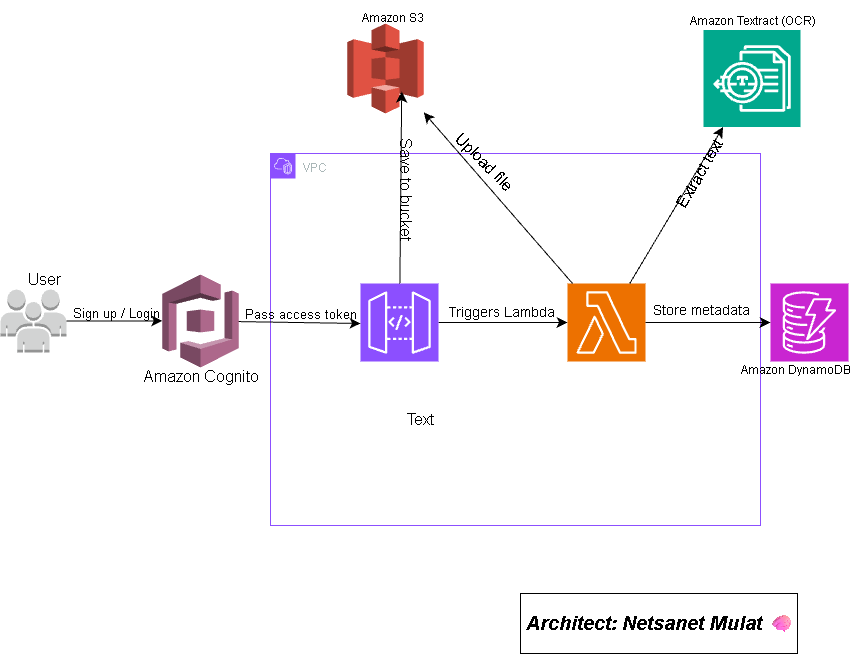

# 📝 AWS Smart Notes OCR Web App

A fully serverless cloud-native web application that lets users upload handwritten or scanned notes and automatically extracts searchable text using Amazon Textract. Built using secure, scalable AWS services.

---

## 🚀 Project Overview

This project allows users to upload notes (e.g., PDF or image files) and receive the extracted text for search or reference. The architecture leverages AWS Lambda, Amazon Textract, S3, API Gateway, Cognito, and DynamoDB — designed with real-world networking best practices (VPC, subnets).

---

## 📌 Architecture Diagram



---

## 🔧 AWS Services Used

 Amazon Cognito – User sign-up, login, and authentication
 API Gateway – REST API for secure communication between frontend and backend
 AWS Lambda – Serverless compute to process uploads and trigger OCR
 Amazon S3 – Scalable storage for uploaded notes (imagesPDFs)
 Amazon Textract – Extracts structured text from documents
 Amazon DynamoDB – NoSQL database to store extracted content and metadata
 Amazon VPC – Network isolation with public and private subnets for secure compute

---

## 🎯 Key Features

 ✅ User login and session handling (Cognito)
 ✅ Upload PDFimage files of notes securely to S3
 ✅ Trigger Textract via Lambda for text extraction
 ✅ Save structured text and metadata (user ID, timestamp, keywords) to DynamoDB
 ✅ Serverless architecture with minimal management overhead

---

## 🛠️ AWS Best Practices Implemented

 IAM roles with least-privilege for all Lambda and S3 actions
 S3 bucket policy for secure, limited access
 Private subnet for Lambda and DynamoDB (no public access)
 Public subnet for API Gateway only
 Route tables and Internet Gateway (IGW) used to control traffic
 Architecture visualized using official AWS architecture icons

---

## 📚 What I Learned

 How to integrate multiple AWS services into a working cloud-native workflow
 VPC networking basics (public vs private subnets, route tables)
 Real-world serverless design triggers, event flows, permissions
 Best practices for IAM, scalability, and stateless processing
 Using Amazon Textract to automate document OCR

---

## 🔜 Future Enhancements

 Add a simple frontend UI (React or HTML form)
 Enable keyword-based search over extracted content
 Add email notifications via Amazon SES
 Deploy architecture using IaC tools (CloudFormation or Terraform)

---

## 👤 Author

Netsanet Mulat
AWS Cloud Solutions Architect Portfolio Project (2025)

[GitHub](https://github.com/netsanet-aws)
[LinkedIn](https://www.linkedin.com/in/netsanet-mulat-034b37301/)


---

## 📂 Repository Structure

```
📁 aws-smart-notes-app
├── README.md               # Project summary and documentation
├── architecture.png        # Visual diagram of architecture
├── lambda                 # Sample Lambda code (placeholder)
├── frontend               # Optional UI code (future)
└── deploy                 # CloudFormation or Terraform templates (future)
```
